# 🐰 RabbitMQ Complete Tutorial & Guide

Welcome to the comprehensive RabbitMQ Tutorial Repository! This guide covers everything from basic concepts to advanced patterns with hands-on examples.

## 🚀 What is RabbitMQ?

RabbitMQ is a robust messaging broker that enables applications to communicate with each other using messages, supporting multiple messaging protocols and patterns. It acts as a middleman for messaging between applications, allowing them to send and receive messages reliably.

## 📚 Repository Structure

```
RabbitMQ/
├── demov0.1/               # Basic messaging examples
│   ├── producer.py         # Simple producer
│   ├── consumer.py         # Simple consumer
│   └── README.md
├── fanout-demo/            # Fanout exchange examples
│   ├── basics/             # Basic fanout implementation
│   └── demov1/            # Advanced fanout with multiple services
│       ├── publisher.py
│       ├── subscriber.py
│       ├── *_subscriber.py # Specialized service subscribers
│       └── *.sh           # Helper scripts
├── rabbitMQ-install.sh     # Installation script
└── requirements.txt        # Python dependencies
```

## 🛠️ Getting Started

### 1. Installation

#### Option A: Use the provided script

```bash
./rabbitMQ-install.sh
```

#### Option B: Manual installation

- [Official Installation Guide](https://www.rabbitmq.com/download.html)

### 2. Enable Management Console

```bash
sudo rabbitmq-plugins enable rabbitmq_management
sudo chown -R rabbitmq:rabbitmq /var/lib/rabbitmq/
```

Then open: <http://localhost:15672> (guest/guest)

### 3. Common Commands

```bash
# List all queues
sudo rabbitmqctl list_queues

# List exchanges
sudo rabbitmqctl list_exchanges

# Check RabbitMQ status
sudo rabbitmqctl status
```

### 4. Install Python Dependencies

```bash
pip install -r requirements.txt
```

## 📖 Learning Path

### Level 1: Basic Messaging (demov0.1/)

**Key Concepts:**

- Default Exchange (Direct Exchange)
- Producer-Consumer pattern
- Queue creation
- Round-robin message distribution

**Important Notes:**

- Routing key and queue name must be the same for default exchange
- Multiple consumers on one queue receive messages in round-robin fashion
- Both producer and consumer can create queues
- Channel is created within a connection
- In multithreaded applications, different threads share a connection

**Files:**

- `producer.py` - Basic message producer
- `consumer.py` - Basic message consumer

### Level 2: Fanout Exchange (fanout-demo/)

#### 🌟 What is Fanout Exchange?

**Fanout Exchange** is RabbitMQ's broadcast messaging mechanism. When a message is published to a fanout exchange, it gets delivered to **ALL** queues bound to that exchange, regardless of routing keys.

```
Publisher ──► Fanout Exchange ──┬──► Queue A ──► Consumer A
                                ├──► Queue B ──► Consumer B  
                                ├──► Queue C ──► Consumer C
                                └──► Queue D ──► Consumer D
```

#### ⚙️ How Fanout Works

1. **Message Broadcasting**: One message published = Multiple copies delivered
2. **No Routing Logic**: Routing keys are completely ignored
3. **Fire-and-Forget Publishing**: Publisher sends once, RabbitMQ distributes automatically

#### 🔑 Key Characteristics

**✅ Advantages:**

- Simple to implement and understand
- Perfect for broadcasting notifications
- Excellent for real-time updates
- Supports multiple consumer types simultaneously

**❌ Limitations:**

- No message filtering capabilities
- All consumers receive all messages
- Can lead to unnecessary network traffic

#### 📊 Message Flow (demov1/)

```mermaid
graph LR
    A[Publisher] -->|Publish Message| B[Fanout Exchange: server-traces]
    B --> C[Queue 1: Notifications]
    B --> D[Queue 2: Logging]
    B --> E[Queue 3: Analytics]
    B --> F[Queue 4: Backup]

    C --> G[📧 Email Service]
    D --> H[📝 Log Service]
    E --> I[📊 Analytics Service]
    F --> J[💾 Backup Service]
```



## 🔄 Multiple Subscribers: Two Approaches

### Approach 1: Multiple Instances (Broadcast Pattern)

**Use Case**: When all subscribers need to receive all messages

**Implementation:**

```python
# Each instance gets a temporary, exclusive queue
result = channel.queue_declare(queue="", exclusive=True)
queue_name = result.method.queue
```

**How to run:**

```bash
cd fanout-demo/demov1/
./run_multiple_subscribers.sh
```

**Advantages:**

- ✅ Simple horizontal scaling
- ✅ No configuration needed
- ✅ Auto-cleanup when disconnected
- ✅ Perfect for load balancing

### Approach 2: Specialized Services (Service-Oriented Pattern)

**Use Case**: When different subscribers handle different parts of the message

**Implementation:**

```python
# Each service gets a named, durable queue
queue_name = "service_queue"
channel.queue_declare(queue=queue_name, durable=True)
```

**Available Services:**

- `notification_subscriber.py` - Handles email/SMS notifications
- `logging_subscriber.py` - Handles system logging
- `analytics_subscriber.py` - Handles metrics and analytics
- `backup_subscriber.py` - Handles backup operations

**How to run:**

```bash
cd fanout-demo/demov1/
./run_specialized_subscribers.sh
```

## 🎯 Queue Types: When to Use What

### Temporary Queues (Recommended for Real-time Services)

**Best for:**

- Analytics dashboards (old metrics become stale)
- Live notifications (outdated alerts aren't useful)
- Real-time monitoring (only current status matters)
- Live chat updates

**Implementation:**

```python
result = channel.queue_declare(queue="", exclusive=True)
queue_name = result.method.queue
```

**Advantages:**

- No message buildup when offline
- Always working with fresh data
- Auto-cleanup prevents resource waste

### Durable Queues (Recommended for Critical Services)

**Best for:**

- Logging service (must capture ALL events)
- Backup service (cannot miss backup requests)
- Audit trail (legal/compliance requirements)
- Financial transactions

**Implementation:**

```python
queue_name = "service_queue"
channel.queue_declare(queue=queue_name, durable=True)
```

**Advantages:**

- Guaranteed message processing
- Catch up on missed work when restarted
- Reliability over real-time performance

### Decision Matrix

| Service Type | Queue Type | Reason |
|-------------|------------|---------|
| **Analytics** | Temporary | Real-time metrics more valuable than old data |
| **Notifications** | Temporary | Old notifications often irrelevant |
| **Monitoring** | Temporary | Only current status matters |
| **Logging** | Durable | Must capture ALL events for debugging |
| **Backup** | Durable | Cannot miss backup requests |
| **Audit** | Durable | Legal/compliance requirements |

## 🚀 Quick Start Examples

### Basic Producer-Consumer (demov0.1/)

```bash
cd demov0.1/
python consumer.py  # Terminal 1
python producer.py  # Terminal 2
```

### Fanout Broadcasting (fanout-demo/demov1/)

```bash
cd fanout-demo/demov1/

# Option 1: Multiple identical subscribers
./run_multiple_subscribers.sh  # Terminal 1
python publisher.py           # Terminal 2

# Option 2: Specialized services
./run_specialized_subscribers.sh  # Terminal 1
python publisher.py              # Terminal 2
```

## 📁 File Overview

### Core Files

- **Publisher/Producer**: Sends messages to exchanges
- **Subscriber/Consumer**: Receives and processes messages
- **Exchange**: Routes messages to queues based on type and rules
- **Queue**: Stores messages until consumed

### Exchange Types Covered

- **Default Exchange**: Direct routing with queue name as routing key
- **Fanout Exchange**: Broadcasts to all bound queues

### Scripts and Utilities

- `rabbitMQ-install.sh` - RabbitMQ installation script
- `run_multiple_subscribers.sh` - Run multiple identical subscribers
- `run_specialized_subscribers.sh` - Run different specialized services
- `requirements.txt` - Python dependencies

## 🔧 Best Practices

### 1. Connection Management

- Create one connection per application
- Use multiple channels within a connection for threading
- Always close connections properly

### 2. Queue Design

- Use temporary queues for real-time, ephemeral data
- Use durable queues for critical, persistent data
- Consider message TTL for time-sensitive data

### 3. Error Handling

- Implement proper exception handling
- Use acknowledgments for critical messages
- Consider dead letter queues for failed messages

### 4. Performance

- Use connection pooling for high-throughput applications
- Batch messages when possible
- Monitor queue depths regularly

## 🎯 Use Cases by Pattern

### Fanout Exchange Perfect For

- **System Monitoring**: Multiple dashboards need the same metrics
- **Notifications**: Email, SMS, push notifications from one event
- **Logging**: Multiple log processors (file, database, search index)
- **Cache Invalidation**: Multiple cache instances need updates
- **Backup Systems**: Multiple backup strategies for same data

### Default Exchange Perfect For

- **Work Distribution**: Multiple workers processing jobs
- **Request-Response**: Direct communication between services
- **Load Balancing**: Distributing work across worker instances

## 🤔 Common Pitfalls & Solutions

### Problem: Messages Lost When Subscriber Offline

**Solution**: Use durable queues for critical data, temporary for real-time data

### Problem: Queue Buildup

**Solution**: Monitor queue depths, implement TTL, scale consumers

### Problem: Duplicate Processing

**Solution**: Implement idempotent message handling

### Problem: Memory Issues

**Solution**: Use temporary queues for non-critical data, implement proper cleanup

## 📚 Next Steps

1. **Advanced Patterns**: Explore topic exchanges, direct exchanges
2. **Clustering**: Set up RabbitMQ clusters for high availability
3. **Management**: Learn RabbitMQ management and monitoring
4. **Performance Tuning**: Optimize for your specific use case
5. **Integration**: Connect with other systems and frameworks

## 🤝 Contributing

Contributions are welcome! Please:

1. Fork the repository
2. Create a feature branch
3. Add tests for new functionality
4. Submit a pull request

## 📄 License

This project is licensed under the [MIT License](LICENSE).

---

🎉 **Happy Messaging with RabbitMQ!** 📨

For questions, issues, or contributions, please open an issue in the repository.
