# Multiple Subscribers Demo - Parallel Processing

This demo shows how to run multiple RabbitMQ subscribers in parallel with different approaches.

## 🎯 Two Approaches for Multiple Subscribers

### Approach 1: Multiple Instances (Broadcast Pattern)

**Use Case**: When all subscribers need to receive all messages

- Run multiple instances of the same subscriber script
- Each gets a temporary, exclusive queue
- All subscribers receive all messages (fanout behavior)

**How to run:**

```bash
./run_multiple_subscribers.sh
```

### Approach 2: Specialized Services (Service-Oriented Pattern)

**Use Case**: When different subscribers handle different parts of the message

- Each service has its own named, durable queue
- All services receive all messages, but process specific data
- Better for microservices architecture

**How to run:**

```bash
./run_specialized_subscribers.sh
```

## 📊 Message Flow Diagrams

### Approach 1: Multiple Generic Subscribers


### Approach 2: Specialized Service Subscribers

```mermaid
graph LR
    A[Publisher] -->|Publish Message| B[Fanout Exchange]
    B --> C[notifications_queue]
    B --> D[logging_queue]
    B --> E[analytics_queue]
    B --> F[backup_queue]

    C --> G[📧 Notification Service]
    D --> H[📝 Logging Service]
    E --> I[📊 Analytics Service]
    F --> J[💾 Backup Service]

    style A fill:#8b0000,stroke:#fff,stroke-width:2px,color:#fff
    style B fill:#2f4f4f,stroke:#fff,stroke-width:2px,color:#fff
    style C fill:#1e3a8a,stroke:#fff,stroke-width:2px,color:#fff
    style D fill:#1e3a8a,stroke:#fff,stroke-width:2px,color:#fff
    style E fill:#1e3a8a,stroke:#fff,stroke-width:2px,color:#fff
    style F fill:#1e3a8a,stroke:#fff,stroke-width:2px,color:#fff
    style G fill:#065f46,stroke:#fff,stroke-width:2px,color:#fff
    style H fill:#065f46,stroke:#fff,stroke-width:2px,color:#fff
    style I fill:#065f46,stroke:#fff,stroke-width:2px,color:#fff
    style J fill:#065f46,stroke:#fff,stroke-width:2px,color:#fff
```



## 🚀 Quick Start

1. **Start RabbitMQ server** (if not already running)
2. **Choose your approach:**
   - For broadcast: `./run_multiple_subscribers.sh`
   - For specialized services: `./run_specialized_subscribers.sh`
3. **Run the publisher** in another terminal: `python publisher.py`
4. **Observe the output** - each subscriber will process messages according to its pattern

## 📁 Files Overview

### Generic Subscribers (Approach 1)

- `subscriber.py` - Original subscriber with temporary queues
- `run_multiple_subscribers.sh` - Script to run multiple instances

### Specialized Subscribers (Approach 2)

- `notification_subscriber.py` - Handles notification data
- `logging_subscriber.py` - Handles logging data  
- `analytics_subscriber.py` - Handles analytics data
- `backup_subscriber.py` - Handles backup data
- `run_specialized_subscribers.sh` - Script to run all services

### Common

- `publisher.py` - Publishes messages to the fanout exchange

## 🔧 Key Differences

| Aspect | Approach 1 | Approach 2 |
|--------|------------|------------|
| Queue Type | Temporary, Exclusive | Named, Durable |
| Message Processing | Full message | Specific data fields |
| Use Case | Load balancing, redundancy | Microservices, specialized handling |
| Queue Persistence | Auto-deleted on disconnect | Persists across restarts |
| Scalability | Horizontal scaling | Service-oriented scaling |

## 💡 When to Use Which?

**Use Approach 1 when:**

- You need load balancing across identical workers
- You want redundancy/backup processing
- All subscribers do the same work
- You don't need message persistence

**Use Approach 2 when:**

- Different subscribers handle different aspects of data
- You're building microservices
- You need specialized processing logic
- You want durable queues that survive restarts
