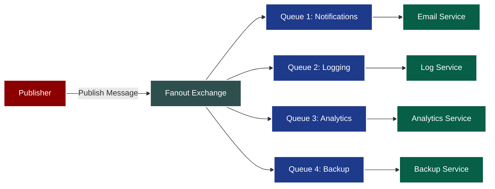

# This demo is to show case how a server instance can push the following data to respective dashboards

## 📊 Message Flow

```mermaid
graph LR
    A[Publisher] -->|Publish Message| B[Fanout Exchange]
    B --> C[Queue 1: Notifications]
    B --> D[Queue 2: Logging]
    B --> E[Queue 3: Analytics]
    B --> F[Queue 4: Backup]

    C --> G[Email Service]
    D --> H[Log Service]
    E --> I[Analytics Service]
    F --> J[Backup Service]

    style A fill:#8b0000,stroke:#fff,stroke-width:2px,color:#fff
    style B fill:#2f4f4f,stroke:#fff,stroke-width:2px,color:#fff
    style C fill:#1e3a8a,stroke:#fff,stroke-width:2px,color:#fff
    style D fill:#1e3a8a,stroke:#fff,stroke-width:2px,color:#fff
    style E fill:#1e3a8a,stroke:#fff,stroke-width:2px,color:#fff
    style F fill:#1e3a8a,stroke:#fff,stroke-width:2px,color:#fff
    style G fill:#065f46,stroke:#fff,stroke-width:2px,color:#fff
    style H fill:#065f46,stroke:#fff,stroke-width:2px,color:#fff
    style I fill:#065f46,stroke:#fff,stroke-width:2px,color:#fff
    style J fill:#065f46,stroke:#fff,stroke-width:2px,color:#fff
```
