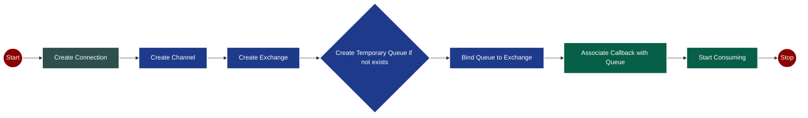

# 🌟 RabbitMQ Fanout Exchange Tutorial

> **Fanout Exchange**: The broadcast messaging pattern that delivers messages to all bound queues simultaneously

## 📋 Table of Contents

- [Overview](#-overview)
- [How Fanout Works](#-how-fanout-works)
- [Key Characteristics](#-key-characteristics)
- [Message Flow](#-message-flow)
- [Use Cases](#-use-cases)
- [Code Examples](#-code-examples)
- [Comparison with Other Exchanges](#-comparison-with-other-exchanges)
- [Best Practices](#-best-practices)
- [Common Pitfalls](#-common-pitfalls)

## 🎯 Overview

**Fanout Exchange** is RabbitMQ's broadcast messaging mechanism. When a message is published to a fanout exchange, it gets delivered to **ALL** queues that are bound to that exchange, regardless of routing keys.

```
Publisher ──► Fanout Exchange ──┬──► Queue A ──► Consumer A
                                ├──► Queue B ──► Consumer B  
                                ├──► Queue C ──► Consumer C
                                └──► Queue D ──► Consumer D
```

## ⚙️ How Fanout Works

### 1. **Message Broadcasting**

- One message published = Multiple copies delivered
- Each bound queue receives an **identical copy** of the message
- Messages are delivered **simultaneously** to all queues

### 2. **No Routing Logic**

- Routing keys are **ignored** completely
- Simple binding: `queue.bind(exchange=fanout_exchange)`
- No complex routing rules needed

### 3. **Fire-and-Forget Publishing**

- Publisher sends once to the exchange
- RabbitMQ handles the distribution automatically
- Publisher doesn't know or care about subscribers

## 🔑 Key Characteristics

### ✅ **Advantages**

| Feature | Description |
|---------|-------------|
| 🚀 **Simple Setup** | No complex routing rules required |
| 📡 **True Broadcasting** | All subscribers get all messages |
| 🔄 **Decoupled Architecture** | Publishers and consumers are independent |
| ⚡ **High Performance** | Efficient message distribution |
| 🛡️ **Fault Tolerant** | Individual consumer failures don't affect others |

### ⚠️ **Important Behaviors**

- **Publisher Ignorance**: Publisher doesn't know who (if anyone) will receive the message
- **No Subscriber Check**: Messages are published even if no consumers exist
- **Message Loss**: If no queues are bound, messages are **dropped/discarded**
- **Explicit Binding Required**: Queues must be explicitly bound to receive messages
- **No Routing Keys**: Routing keys in `basic_publish()` are ignored

## 🔢 Fanout algorithm



## 🚀 Use Cases

### 1. **News Broadcasting System**

```

News Publisher ──► Fanout Exchange ──┬──► Mobile App Queue
                                     ├──► Web App Queue
                                     ├──► Email Newsletter Queue
                                     └──► Push Notification Queue

```

### 2. **System Monitoring & Logging**

```

Application ──► Monitoring Exchange ──┬──► Error Log Queue
                                      ├──► Metrics Queue
                                      ├──► Alert Queue
                                      └──► Audit Queue

```

### 3. **E-commerce Order Processing**

```

Order Placed ──► Order Exchange ──┬──► Inventory Update Queue
                                  ├──► Payment Processing Queue
                                  ├──► Shipping Queue
                                  ├──► Customer Notification Queue
                                  └──► Analytics Queue

```

### 4. **IoT Data Distribution**

```

Sensor Data ──► IoT Exchange ──┬──► Real-time Dashboard Queue
                               ├──► Database Storage Queue
                               ├──► Alert System Queue
                               └──► ML Processing Queue

```

## 💻 Code Examples

### Publisher Example

```python
import pika
import json
import datetime

def publish_news_update():
    # Connect to RabbitMQ
    connection = pika.BlockingConnection(
        pika.ConnectionParameters('localhost')
    )
    channel = connection.channel()
    
    # Declare fanout exchange
    channel.exchange_declare(
        exchange='news_broadcast',
        exchange_type='fanout',
        durable=True  # Exchange survives server restart
    )
    
    # Create news message
    news_data = {
        'headline': 'Breaking: New Technology Breakthrough!',
        'content': 'Scientists discover revolutionary method...',
        'timestamp': datetime.datetime.now().isoformat(),
        'category': 'technology'
    }
    
    # Publish to fanout exchange
    channel.basic_publish(
        exchange='news_broadcast',
        routing_key='',  # Ignored in fanout
        body=json.dumps(news_data),
        properties=pika.BasicProperties(
            delivery_mode=2,  # Make message persistent
            content_type='application/json'
        )
    )
    
    print(f"📡 News broadcast sent: {news_data['headline']}")
    connection.close()

if __name__ == '__main__':
    publish_news_update()
```

### Consumer Example (Mobile App)

```python
import pika
import json

def setup_mobile_consumer():
    connection = pika.BlockingConnection(
        pika.ConnectionParameters('localhost')
    )
    channel = connection.channel()
    
    # Declare the same exchange
    channel.exchange_declare(
        exchange='news_broadcast',
        exchange_type='fanout',
        durable=True
    )
    
    # Create exclusive queue for mobile app
    result = channel.queue_declare(
        queue='mobile_notifications',
        durable=True
    )
    queue_name = result.method.queue
    
    # Bind queue to fanout exchange
    channel.queue_bind(
        exchange='news_broadcast',
        queue=queue_name
    )
    
    def process_news(ch, method, properties, body):
        try:
            news = json.loads(body.decode())
            print(f"📱 Mobile App: {news['headline']}")
            print(f"   Category: {news['category']}")
            print(f"   Time: {news['timestamp']}")
            
            # Simulate mobile notification processing
            send_push_notification(news)
            
            # Acknowledge message
            ch.basic_ack(delivery_tag=method.delivery_tag)
            
        except Exception as e:
            print(f"❌ Error processing news: {e}")
            ch.basic_nack(delivery_tag=method.delivery_tag, requeue=False)
    
    def send_push_notification(news):
        # Simulate push notification logic
        print(f"🔔 Push notification sent to mobile users")
    
    # Set up consumer
    channel.basic_qos(prefetch_count=1)
    channel.basic_consume(
        queue=queue_name,
        on_message_callback=process_news
    )
    
    print('📱 Mobile app consumer waiting for news...')
    channel.start_consuming()

if __name__ == '__main__':
    setup_mobile_consumer()
```

## ⚖️ Comparison with Other Exchanges

| Exchange Type | Routing | Use Case | Example |
|---------------|---------|----------|---------|
| **Fanout** | None (broadcast) | All consumers get all messages | News broadcasting |
| **Direct** | Exact routing key match | Targeted delivery | Task queues by priority |
| **Topic** | Pattern matching | Selective broadcasting | Log filtering by severity |
| **Headers** | Header attributes | Complex routing logic | Message routing by metadata |

## 🏆 Best Practices

### 1. **Exchange Configuration**

```python
# Always declare exchanges as durable for production
channel.exchange_declare(
    exchange='my_fanout',
    exchange_type='fanout',
    durable=True,          # Survives server restart
    auto_delete=False      # Don't delete when unused
)
```

### 2. **Queue Management**

```python
# Use durable queues for important messages
channel.queue_declare(
    queue='important_consumer',
    durable=True,
    exclusive=False,
    auto_delete=False
)
```

### 3. **Message Properties**

```python
# Make messages persistent
properties = pika.BasicProperties(
    delivery_mode=2,           # Persistent message
    content_type='application/json',
    timestamp=int(time.time()),
    message_id=str(uuid.uuid4())
)
```

### 4. **Error Handling**

```python
def robust_consumer_callback(ch, method, properties, body):
    try:
        # Process message
        process_message(body)
        ch.basic_ack(delivery_tag=method.delivery_tag)
    except RetryableError as e:
        # Requeue for retry
        ch.basic_nack(delivery_tag=method.delivery_tag, requeue=True)
    except FatalError as e:
        # Don't requeue, send to DLX
        ch.basic_nack(delivery_tag=method.delivery_tag, requeue=False)
```

## ⛔ Common Pitfalls

### 1. **Message Loss Scenarios**

```python
# ❌ BAD: Publishing before any queues are bound
channel.basic_publish(exchange='fanout_ex', routing_key='', body='msg')
# Message is LOST if no queues are bound yet!

# ✅ GOOD: Ensure queues are bound before publishing
channel.queue_declare(queue='consumer1')
channel.queue_bind(exchange='fanout_ex', queue='consumer1')
# Now safe to publish
```

### 2. **Forgetting Queue Binding**

```python
# ❌ BAD: Queue exists but not bound
channel.queue_declare(queue='my_queue')
# Queue exists but won't receive fanout messages!

# ✅ GOOD: Always bind to exchange
channel.queue_bind(exchange='fanout_ex', queue='my_queue')
```

### 3. **Resource Management**

```python
# ❌ BAD: Not closing connections
connection = pika.BlockingConnection(params)
# ... do work ...
# Connection left open!

# ✅ GOOD: Always close connections
try:
    connection = pika.BlockingConnection(params)
    # ... do work ...
finally:
    connection.close()
```

### 4. **Ignoring Message Acknowledgments**

```python
# ❌ BAD: Auto-ack without error handling
channel.basic_consume(queue='q', callback=process, auto_ack=True)
# Messages lost if processing fails!

# ✅ GOOD: Manual acknowledgment with error handling
channel.basic_consume(queue='q', callback=safe_process, auto_ack=False)
```

## 🔧 Testing Your Fanout Setup

### Quick Test Script

```python
import pika
import time
import threading

def test_fanout():
    connection = pika.BlockingConnection(pika.ConnectionParameters('localhost'))
    channel = connection.channel()
    
    # Setup
    channel.exchange_declare(exchange='test_fanout', exchange_type='fanout')
    
    # Create multiple test queues
    for i in range(3):
        queue_name = f'test_queue_{i}'
        channel.queue_declare(queue=queue_name)
        channel.queue_bind(exchange='test_fanout', queue=queue_name)
    
    # Send test message
    channel.basic_publish(
        exchange='test_fanout',
        routing_key='',
        body=f'Test message at {time.time()}'
    )
    
    print("✅ Test message sent to fanout exchange")
    connection.close()

if __name__ == '__main__':
    test_fanout()
```

---

## 📚 Additional Resources

- [RabbitMQ Official Documentation](https://www.rabbitmq.com/tutorials/tutorial-three-python.html)
- [AMQP 0-9-1 Model Explained](https://www.rabbitmq.com/tutorials/amqp-concepts.html)
- [Message Queuing Patterns](https://www.enterpriseintegrationpatterns.com/patterns/messaging/)

---

**🎉 Happy Broadcasting with RabbitMQ Fanout Exchanges!**
