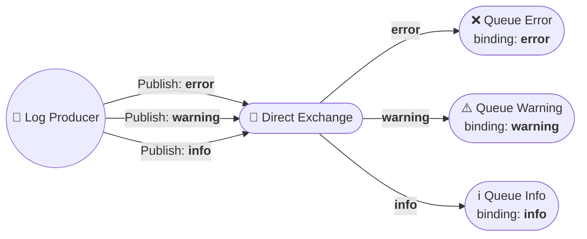
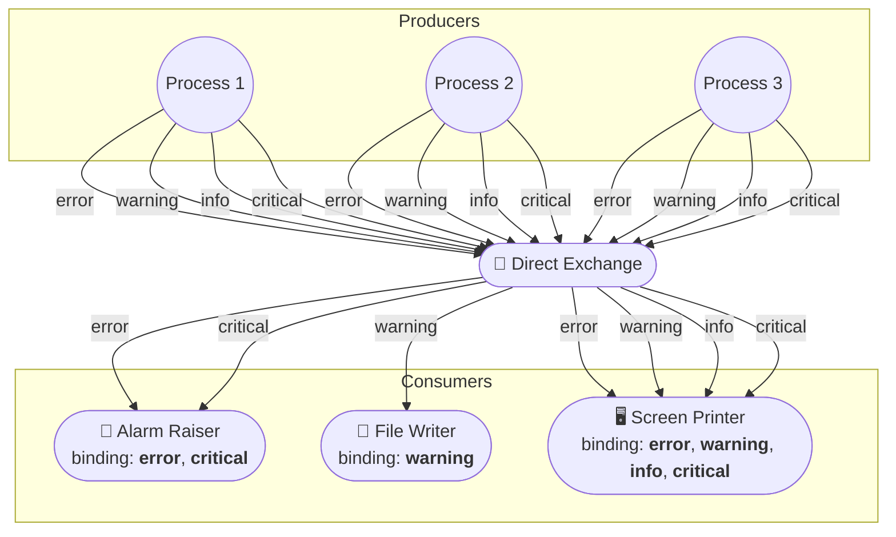

# 🛣️ Selective Routing in RabbitMQ — Direct Exchange

Selective routing enables messages to be delivered to specific queues based on routing keys. In RabbitMQ, a **direct exchange** routes messages to queues whose binding keys exactly match the message's routing key, providing precise and efficient message delivery.

---

## 🔄 Direct Exchange Flow

---

## 📦 What is a Direct Exchange?

- 🗝️ **Routing by Key:** Messages are routed based on an exact match between the message's routing key and the queue's binding key.
- 🔗 **Binding:** Each queue binds to the exchange with a specific routing key.
- 👥 **Multiple Bindings:** A queue can have multiple bindings (with different routing keys) to the same exchange.
- ♻️ **Shared Routing Keys:** Multiple queues can bind to the exchange using the same routing key, allowing message fan-out.
- 📤 **Selective Delivery:** The exchange delivers messages only to queues with matching bindings.
- 🚫 **No Match, No Delivery:** Messages with routing keys that do not match any binding are discarded (unless an alternate exchange is configured).

---

## 📝 Publisher Workflow (Direct Exchange)

1. 🔌 **Connect** to RabbitMQ.
2. 📚 **Create/Get Channel** for communication.
3. 🏷️ **Declare Direct Exchange** (e.g., `logs_direct`).
4. 🗝️ **Set Routing Key** (e.g., `error`, `warning`, `info`).
5. 📤 **Publish Message** to the exchange with the routing key.
6. 🔒 **Close Channel & Connection** when done.

---

## 📥 Subscriber Workflow (Direct Exchange)

1. 🔌 **Connect** to RabbitMQ.
2. 📚 **Create/Get Channel**.
3. 🏷️ **Declare the Same Direct Exchange**.
4. 📦 **Declare Queue** (e.g., `error_logs`).
5. 🔗 **Bind Queue** to the exchange with desired routing key(s).
6. 👂 **Consume Messages** from the queue.
7. ⚙️ **Process Messages** as needed.
8. 🔒 **Close Channel & Connection** when finished.

---

## 📝 Example Use Cases

- **Log Aggregation:** Route error, warning, and info logs to different queues for separate processing.
- **Task Distribution:** Send tasks to specific worker queues based on task type.
- **Notification Systems:** Deliver notifications to users or services based on event type.

## Demo usecase

---

## 📚 Further Reading

- [RabbitMQ Direct Exchange Documentation](https://www.rabbitmq.com/tutorials/amqp-concepts.html#exchange-direct)
- [RabbitMQ Tutorials](https://www.rabbitmq.com/getstarted.html)

---
